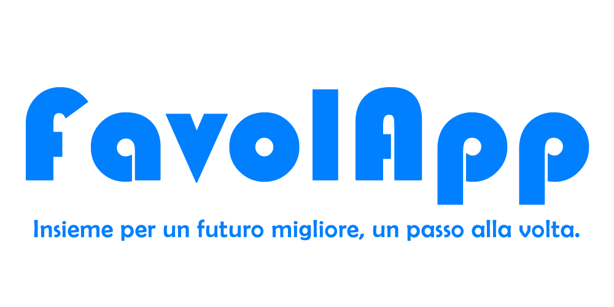

# README - FavolApp

FavolApp è concepita come un'innovativa piattaforma digitale per la gestione dei pazienti con autismo e disturbi del comportamento e dell'apprendimento. L'obiettivo è creare uno strumento che permetta ai supervisori di monitorare e gestire il lavoro dei tutor in modo efficiente e dettagliato. I tutor potranno utilizzare l'applicazione per creare schede interattive personalizzate, progettate per stimolare l'apprendimento dei pazienti, e per redigere report dettagliati sui loro progressi. Inoltre, il sistema prevede un pannello di amministrazione centralizzato che faciliterà il monitoraggio delle attività e l'analisi dei dati, consentendo interventi tempestivi e mirati. L'applicazione mira a migliorare la comunicazione e la coesione tra supervisori e tutor, ottimizzando così l'efficacia degli interventi terapeutici.

## La Documentazione

E’ possibile consultare la completa documentazione al seguente link [Documentazione](Documentazione_Progetto_SAD_Francesco_Scognamiglio_M63001364_Felice Micillo_M63001377.pdf)

- Introduzione
- Avvio della progettazione
- Analisi dei requisiti
- Architettura e progettazione del software
- Processo di sviluppo
- Tecnologie utilizzate
- Specifiche di implementazione
- Testing
- Presentazione del prodotto

## Tools utilizzati

| **FRONT END**                                             | **TOOLS**            |
| --------------------------------------------------------- | -------------------- |
| _FRAMEWORK_                                               | ReactJs              |
| _LANGUAGE_                                                | HTML, CSS, JSX       |
| **BACK END**                                              |                      |
| _FRAMEWORK_                                               | Serverless Framework |
| _LANGUAGE_                                                | JS, MJS              |
| _TESTING_                                                 | Jest, Grafana k6     |
| _CLOUD SERVICES_                                          | Amazon Web Services  |
| **TOOLS PER IL SUPPORTO ALLA REALIZZAZIONE DEL SOFTWARE** |                      |
| _CODE_                                                    | VISUAL STUDIO CODE   |
| _UML DESIGN_                                              | VISUAL PARADIGM      |
| _SCRUM SUPPORT_                                           | GitLab               |
| _WEB HOSTING_                                             | Amazon S3            |

## System Context Diagram

Il System Context Diagram, offre una panoramica ad alto livello delle interazioni tra il sistema e i suoi attori esterni, mostrando come il sistema comunica con le entità circostanti. Nel diagramma, viene rappresentato il sistema centrale, evidenziando i principali attori coinvolti e i flussi di dati che intercorrono tra loro. Il diagramma è utile per comprendere il perimetro del sistema, senza entrare nei dettagli tecnici dei collegamenti interni o delle implementazioni specifiche.

## Guida per l’utilizzo dell’applicazione

Al seguente link si può provare la web application
[https://www.favolapp.it/](https://www.favolapp.it/)

🔒 **Credenziali di accesso**

👔 **Tutor:**

- Email: sadtutor24@gmail.com
- Password: **#w}n7YK4Wn**

👔 **Supervisore:**

- Email: favolappmin24@gmail.com
- Password: **3uo2ZUUoy`**

# Gli Autori

- Francesco Scognamiglio
- Felice Micillo
